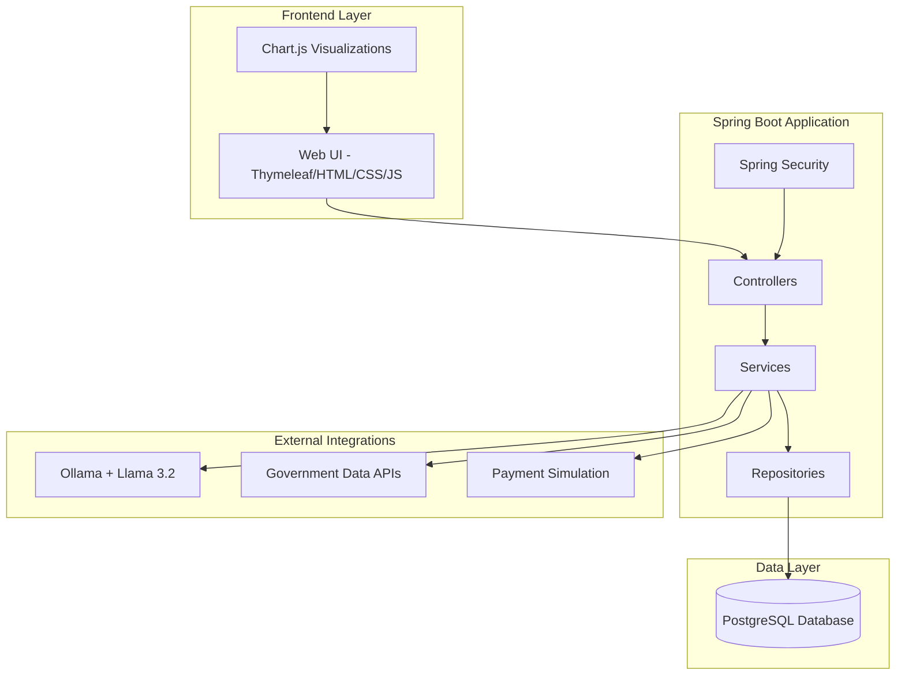
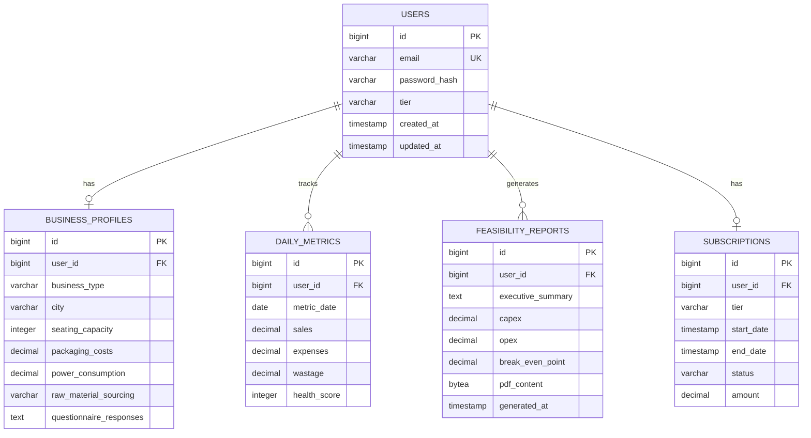

# Design Document: ArthSethu Platform

## Overview

ArthSethu is a comprehensive FinTech AI-SaaS platform built using Java Spring Boot with a monolithic architecture. The platform provides financial intelligence through three tiers: Aarambh (free), Vistar (₹499/month), and Shikhar (₹999/month). The system integrates government open data, local AI processing via Ollama/Llama 3.2, and provides dynamic questionnaires, feasibility analysis, operational dashboards, and AI-powered financial advisory services.

## Architecture

### High-Level Architecture



### Technology Stack

- **Backend Framework**: Spring Boot 3.2+ with Java 17+
- **Build Tool**: Maven with standard pom.xml structure
- **Database**: PostgreSQL with Spring Data JPA
- **Security**: Spring Security for authentication and authorization
- **Frontend**: Thymeleaf templates with HTML5, CSS3, Vanilla JavaScript
- **Visualizations**: Chart.js for dashboards and financial charts
- **AI Integration**: Ollama with Llama 3.2 via Spring AI framework
- **Government Data**: REST API integration with data.gov.in platform

## Components and Interfaces

### Core Package Structure

```
src/main/java/com/arthsethu/
├── ArthSethuApplication.java
├── config/
│   ├── SecurityConfig.java
│   ├── DatabaseConfig.java
│   └── OllamaConfig.java
├── controller/
│   ├── OnboardingController.java
│   ├── DashboardController.java
│   ├── SubscriptionController.java
│   ├── AICFOController.java
│   └── AdminController.java
├── service/
│   ├── OnboardingService.java
│   ├── FeasibilityEngineService.java
│   ├── HealthScoreService.java
│   ├── SubscriptionService.java
│   ├── AICFOService.java
│   ├── GovernmentDataService.java
│   └── AdminService.java
├── repository/
│   ├── UserRepository.java
│   ├── BusinessProfileRepository.java
│   ├── SubscriptionRepository.java
│   ├── DailyMetricsRepository.java
│   └── FeasibilityReportRepository.java
├── model/
│   ├── User.java
│   ├── BusinessProfile.java
│   ├── Subscription.java
│   ├── DailyMetrics.java
│   ├── FeasibilityReport.java
│   └── QuestionnaireResponse.java
└── dto/
    ├── OnboardingRequest.java
    ├── FeasibilityReportDTO.java
    ├── HealthScoreDTO.java
    └── AICFORequest.java
```

### Key Interfaces

#### OnboardingService Interface
```java
public interface OnboardingService {
    QuestionnaireStep getNextQuestion(String businessType, Map<String, Object> responses);
    BusinessProfile createBusinessProfile(OnboardingRequest request);
    FeasibilityReport generateFeasibilityReport(BusinessProfile profile);
}
```

#### FeasibilityEngineService Interface
```java
public interface FeasibilityEngineService {
    MarketData fetchGovernmentData(String city, String businessType);
    CostAnalysis calculateCosts(BusinessProfile profile, MarketData data);
    byte[] generatePDFReport(FeasibilityReport report);
}
```

#### AICFOService Interface
```java
public interface AICFOService {
    String processQuery(String query, BusinessProfile profile, List<DailyMetrics> history);
    WhatIfAnalysis performSimulation(String scenario, BusinessProfile profile);
}
```

## Data Models

### Core Entities

#### User Entity
```java
@Entity
@Table(name = "users")
public class User {
    @Id
    @GeneratedValue(strategy = GenerationType.IDENTITY)
    private Long id;
    
    @Column(unique = true, nullable = false)
    private String email;
    
    @Column(nullable = false)
    private String passwordHash;
    
    @Enumerated(EnumType.STRING)
    private SubscriptionTier tier;
    
    @OneToOne(mappedBy = "user", cascade = CascadeType.ALL)
    private BusinessProfile businessProfile;
    
    @OneToMany(mappedBy = "user", cascade = CascadeType.ALL)
    private List<DailyMetrics> dailyMetrics;
    
    // Constructors, getters, setters
}
```

#### BusinessProfile Entity
```java
@Entity
@Table(name = "business_profiles")
public class BusinessProfile {
    @Id
    @GeneratedValue(strategy = GenerationType.IDENTITY)
    private Long id;
    
    @OneToOne
    @JoinColumn(name = "user_id")
    private User user;
    
    @Enumerated(EnumType.STRING)
    private BusinessType businessType;
    
    private String city;
    private Integer seatingCapacity;
    private Double packagingCosts;
    private Double powerConsumption;
    private String rawMaterialSourcing;
    
    @Column(columnDefinition = "TEXT")
    private String questionnaireResponses; // JSON format
    
    // Constructors, getters, setters
}
```

#### DailyMetrics Entity
```java
@Entity
@Table(name = "daily_metrics")
public class DailyMetrics {
    @Id
    @GeneratedValue(strategy = GenerationType.IDENTITY)
    private Long id;
    
    @ManyToOne
    @JoinColumn(name = "user_id")
    private User user;
    
    @Column(nullable = false)
    private LocalDate date;
    
    @Column(nullable = false)
    private BigDecimal sales;
    
    @Column(nullable = false)
    private BigDecimal expenses;
    
    @Column(nullable = false)
    private BigDecimal wastage;
    
    private Integer healthScore;
    
    // Constructors, getters, setters
}
```

### Database Schema Design



## Correctness Properties

*A property is a characteristic or behavior that should hold true across all valid executions of a system—essentially, a formal statement about what the system should do. Properties serve as the bridge between human-readable specifications and machine-verifiable correctness guarantees.*

Based on the prework analysis, here are the key correctness properties for the ArthSethu platform:

### Property 1: Dynamic Questionnaire Decision Tree Logic
*For any* business type selection and sequence of questionnaire responses, the next question should be deterministically determined by the decision tree logic, with Cafe leading to seating capacity questions, Cloud Kitchen leading to packaging cost questions, and Manufacturing leading to power consumption and raw material questions.
**Validates: Requirements 1.1, 1.2, 1.3, 1.4**

### Property 2: Profile Creation from Questionnaire Completion
*For any* completed questionnaire response set, the system should always create a tailored business profile containing all the provided information.
**Validates: Requirements 1.5**

### Property 3: Government Data Integration and Location Awareness
*For any* city and business type combination, the feasibility engine should successfully fetch location-specific data (commercial rent, wages, commodity prices) from government APIs and return data that corresponds to the specified location and business requirements.
**Validates: Requirements 2.1, 2.2, 2.3, 2.4, 2.5**

### Property 4: Comprehensive Feasibility Report Generation
*For any* completed business profile, the system should generate a feasibility report that always contains an executive summary, CAPEX vs OPEX visualizations, break-even analysis, and provides valid PDF download functionality.
**Validates: Requirements 3.1, 3.2, 3.3, 3.4, 3.5**

### Property 5: Health Score Calculation and Bounds
*For any* set of daily metrics (sales, expenses, wastage), the health score calculation should always produce a value between 0-100, and increasing wastage should result in proportionally decreasing health scores.
**Validates: Requirements 4.2, 4.3**

### Property 6: Tier-Specific Feature Access Control
*For any* user and feature combination, the system should restrict access based on subscription tier, with Vistar users seeing daily metric prompts, and upgrade prompts appearing for premium features when accessed by lower-tier users.
**Validates: Requirements 4.1, 5.1, 5.5**

### Property 7: Subscription Management and Pricing Consistency
*For any* upgrade interaction, the system should display correct pricing (Vistar ₹499/month, Shikhar ₹999/month), trigger payment modals on selection, and activate the selected tier upon successful payment simulation.
**Validates: Requirements 5.2, 5.3, 5.4**

### Property 8: AI CFO Contextual Response Generation
*For any* user query to the AI CFO, the response should incorporate the user's specific business data, provide quantitative analysis with recommendations, and integrate both historical user data and current market conditions.
**Validates: Requirements 6.2, 6.3, 6.4**

### Property 9: Technology Stack Integration Compliance
*For any* system component, the implementation should use the specified technology stack (PostgreSQL, Spring Security, Thymeleaf, Chart.js) and maintain proper integration between all framework components.
**Validates: Requirements 6.1, 6.5, 8.1, 8.2, 9.2, 9.3, 9.5**

### Property 10: Admin Dashboard Comprehensive Monitoring
*For any* admin dashboard access, the interface should display accurate user counts across all tiers, current API status with timestamps, revenue tracking visualizations, and system alerts when errors occur.
**Validates: Requirements 7.1, 7.2, 7.3, 7.4, 7.5**

### Property 11: Data Security and Encryption
*For any* sensitive financial data storage operation, the system should encrypt the data before database persistence and maintain data integrity across all user interactions.
**Validates: Requirements 8.3, 8.4**

### Property 12: UI Content and Visualization Requirements
*For any* page rendering, the system should display the correct dark-themed UI with "Don't just dream. Calculate." hero text, include appropriate Chart.js visualizations for financial data, and maintain responsive design across devices.
**Validates: Requirements 9.1, 9.4**

<function_calls>
<invoke name="prework">
<parameter name="featureName">arthsethu-platform

## Error Handling

### Exception Handling Strategy

The platform implements comprehensive error handling across all layers:

#### Controller Layer Error Handling
- **@ControllerAdvice** for global exception handling
- **Custom exception classes** for business logic errors
- **HTTP status code mapping** for different error types
- **User-friendly error pages** with consistent styling

#### Service Layer Error Handling
- **Government API failures**: Graceful degradation with cached data
- **AI service unavailability**: Fallback to basic financial calculations
- **Database connection issues**: Retry mechanisms with exponential backoff
- **Validation errors**: Clear error messages with field-specific feedback

#### Integration Error Handling
- **Ollama connection failures**: Service health checks and automatic reconnection
- **Government API rate limiting**: Request queuing and throttling
- **Payment simulation errors**: Clear error states and retry options
- **PDF generation failures**: Alternative report formats

### Error Response Format
```json
{
    "timestamp": "2024-01-15T10:30:00Z",
    "status": 400,
    "error": "Bad Request",
    "message": "Invalid business type selection",
    "path": "/api/onboarding/questionnaire",
    "details": {
        "field": "businessType",
        "rejectedValue": "invalid_type",
        "allowedValues": ["CAFE", "CLOUD_KITCHEN", "MANUFACTURING"]
    }
}
```

## Testing Strategy

### Dual Testing Approach

The ArthSethu platform requires both unit testing and property-based testing for comprehensive coverage:

#### Unit Testing
- **Specific examples**: Test concrete scenarios like "Cafe with 20 seats in Mumbai"
- **Edge cases**: Empty questionnaire responses, invalid city names, zero metrics
- **Integration points**: Controller-Service interactions, database operations
- **Error conditions**: API failures, invalid user inputs, authentication errors

#### Property-Based Testing
- **Universal properties**: Test behaviors that should hold for all valid inputs
- **Comprehensive input coverage**: Generate random business profiles, metrics, and user data
- **Framework**: Use **QuickTheories** for Java property-based testing
- **Configuration**: Minimum 100 iterations per property test
- **Tagging**: Each test references its design document property

### Property-Based Testing Configuration

Each property test must be implemented with the following structure:

```java
@Test
@Tag("Feature: arthsethu-platform, Property 1: Dynamic Questionnaire Decision Tree Logic")
void testQuestionnaireDecisionTreeLogic() {
    qt()
        .forAll(businessTypes(), questionnaireResponses())
        .checkAssert((businessType, responses) -> {
            QuestionnaireStep nextStep = onboardingService.getNextQuestion(businessType, responses);
            assertThat(nextStep).satisfiesDecisionTreeLogic(businessType, responses);
        });
}
```

### Testing Framework Selection

- **Unit Testing**: JUnit 5 with Mockito for mocking
- **Property-Based Testing**: QuickTheories library
- **Integration Testing**: Spring Boot Test with TestContainers for PostgreSQL
- **Web Testing**: Spring MockMvc for controller testing
- **AI Testing**: Mock Ollama responses for consistent testing

### Test Data Management

- **Test Profiles**: Predefined business profiles for consistent testing
- **Mock Government Data**: Cached responses for API integration tests
- **Database Seeding**: Flyway migrations for test data setup
- **Property Generators**: Custom generators for business-specific data types

### Coverage Requirements

- **Unit Test Coverage**: Minimum 80% line coverage for service and repository layers
- **Property Test Coverage**: All 12 correctness properties must have corresponding tests
- **Integration Coverage**: End-to-end flows for each subscription tier
- **Error Path Coverage**: All exception handling paths must be tested

## Implementation Notes

### Maven Dependencies (pom.xml)

```xml
<dependencies>
    <!-- Spring Boot Starters -->
    <dependency>
        <groupId>org.springframework.boot</groupId>
        <artifactId>spring-boot-starter-web</artifactId>
    </dependency>
    <dependency>
        <groupId>org.springframework.boot</groupId>
        <artifactId>spring-boot-starter-data-jpa</artifactId>
    </dependency>
    <dependency>
        <groupId>org.springframework.boot</groupId>
        <artifactId>spring-boot-starter-security</artifactId>
    </dependency>
    <dependency>
        <groupId>org.springframework.boot</groupId>
        <artifactId>spring-boot-starter-thymeleaf</artifactId>
    </dependency>
    
    <!-- Database -->
    <dependency>
        <groupId>org.postgresql</groupId>
        <artifactId>postgresql</artifactId>
        <scope>runtime</scope>
    </dependency>
    
    <!-- Spring AI for Ollama Integration -->
    <dependency>
        <groupId>org.springframework.ai</groupId>
        <artifactId>spring-ai-ollama-spring-boot-starter</artifactId>
        <version>1.0.0-M4</version>
    </dependency>
    
    <!-- PDF Generation -->
    <dependency>
        <groupId>com.itextpdf</groupId>
        <artifactId>itext7-core</artifactId>
        <version>8.0.2</version>
    </dependency>
    
    <!-- Testing -->
    <dependency>
        <groupId>org.springframework.boot</groupId>
        <artifactId>spring-boot-starter-test</artifactId>
        <scope>test</scope>
    </dependency>
    <dependency>
        <groupId>org.quicktheories</groupId>
        <artifactId>quicktheories</artifactId>
        <version>0.26</version>
        <scope>test</scope>
    </dependency>
</dependencies>
```

### Application Configuration (application.properties)

```properties
# Server Configuration
server.port=8080
server.servlet.context-path=/arthsethu

# Database Configuration
spring.datasource.url=jdbc:postgresql://localhost:5432/arthsethu
spring.datasource.username=${DB_USERNAME:arthsethu_user}
spring.datasource.password=${DB_PASSWORD:secure_password}
spring.jpa.hibernate.ddl-auto=validate
spring.jpa.show-sql=false
spring.jpa.properties.hibernate.dialect=org.hibernate.dialect.PostgreSQLDialect

# Thymeleaf Configuration
spring.thymeleaf.cache=false
spring.thymeleaf.prefix=classpath:/templates/
spring.thymeleaf.suffix=.html

# Spring AI Ollama Configuration
spring.ai.ollama.base-url=http://localhost:11434
spring.ai.ollama.chat.model=llama3.2
spring.ai.ollama.chat.options.temperature=0.7

# Government API Configuration
arthsethu.gov-api.base-url=https://api.data.gov.in
arthsethu.gov-api.timeout=30000
arthsethu.gov-api.retry-attempts=3

# File Upload Configuration
spring.servlet.multipart.max-file-size=10MB
spring.servlet.multipart.max-request-size=10MB

# Logging Configuration
logging.level.com.arthsethu=INFO
logging.level.org.springframework.ai=DEBUG
```

### Security Configuration Highlights

- **JWT-based authentication** for API endpoints
- **Role-based authorization** (USER, ADMIN roles)
- **CSRF protection** for form submissions
- **Password encryption** using BCrypt
- **Session management** with secure cookies
- **Rate limiting** for API endpoints to prevent abuse

### Performance Considerations

- **Database indexing** on frequently queried fields (user_id, date, city)
- **Caching strategy** for government data using Spring Cache
- **Connection pooling** for database and external API connections
- **Async processing** for PDF generation and AI queries
- **CDN integration** for static assets (CSS, JS, images)

This design provides a solid foundation for implementing the ArthSethu platform with proper separation of concerns, comprehensive testing, and scalable architecture patterns.